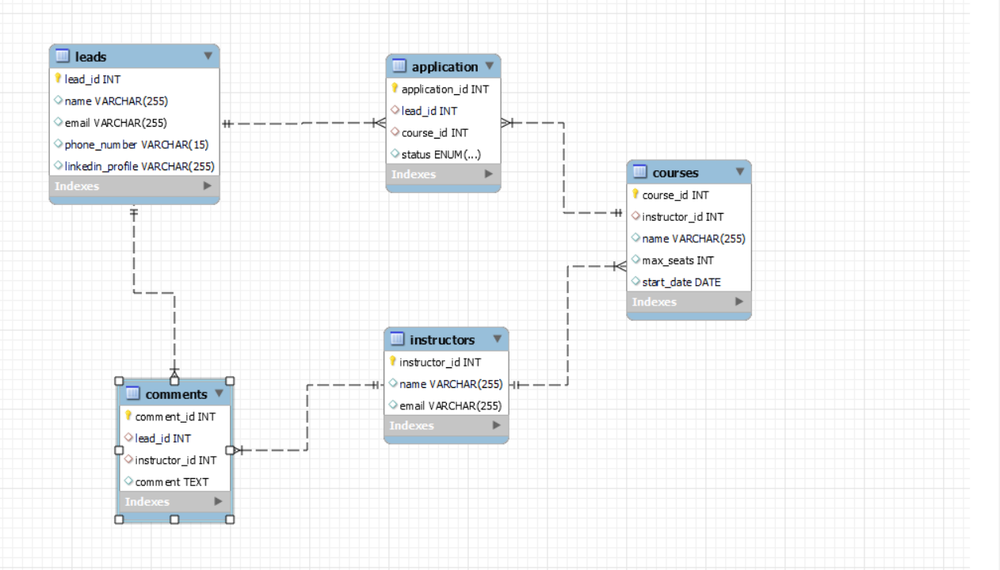

# 🚀 Airtribe-Backend-Assignment

`Node Js` + `MySQL` 

This project is a backend server for the Airtribe application. It's built with Node.js and Express, and uses MySQL for the database.

## Important Links
- `Postman Documentation` : https://documenter.getpostman.com/view/32360617/2sA2xh3D84     

## 📚 Database Structure

The database for this project is structured as follows:

- `Instructors`: This table stores instructor information. Each instructor has an `instructor_id`, `name`, and `email`.
- `Courses`: This table stores course information. Each course has a `course_id`, `instructor_id`, `name`, `max_seats`, and `start_date`.
- `Leads`: This table stores lead information. Each lead has a `lead_id`, `name`, `email`, `phone_number`, `linkedin_profile` and `course_id`.
- `Comments`: This table stores comment information. Each comment has a `comment_id`, `lead_id`, `instructor_id`, and `comment`.
- `Application`: This table stores application information. Each application has an `application_id`, `lead_id`, `course_id`, and `status`.




## 📁 File Structure

The file structure for this project is as follows:

- `server/`: This directory contains all the server-side code.
  - `controllers/`: This directory contains the controller files for the courses and leads.
  - `database/`: This directory contains the database connection file and SQL queries.
  - `routes/`: This directory contains the route definitions for the server.
  - `server.js`: This is the main server file.

## 🚦 Routes and Logics

The routes for this project are defined in `server/routes/route.js`. The logic for each route is defined in the corresponding controller file in the `server/controllers/` directory.

## 🐳 Docker Commands

To build and run the Docker container for this project, use the following command:

```sh
docker-compose up -d --build .
docker run -p 5050:5050 airtribe-backend-assignment


## 🚀 Getting Started
Clone the repository.
Install the dependencies with npm install.
Set up the database by running the SQL queries in server/database/dbQuery.sql.
Start the server with node server/server.js.


## Developer
- Abhay Sahani ( 12115826 )
Github: its-abhaysahani

```
